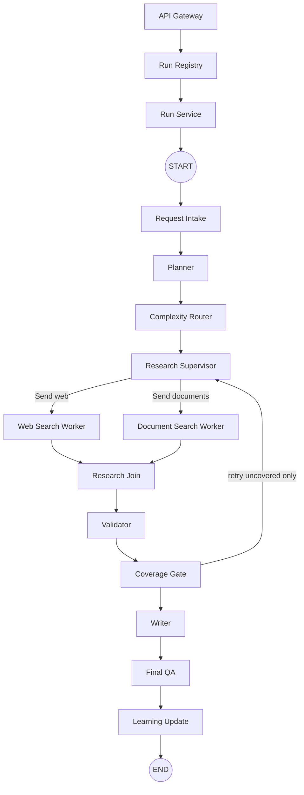

# Colitech graph

API Gateway, Run Registry, and Run Service stay outside LangGraph. The compiled graph is created once and reused. The summarizer is a worker utility, not a dispatched node. User feedback is stored after the run through the API.
